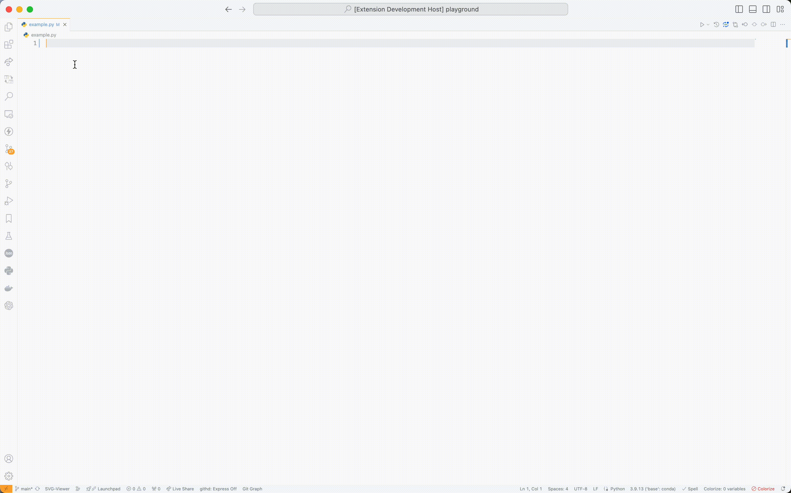
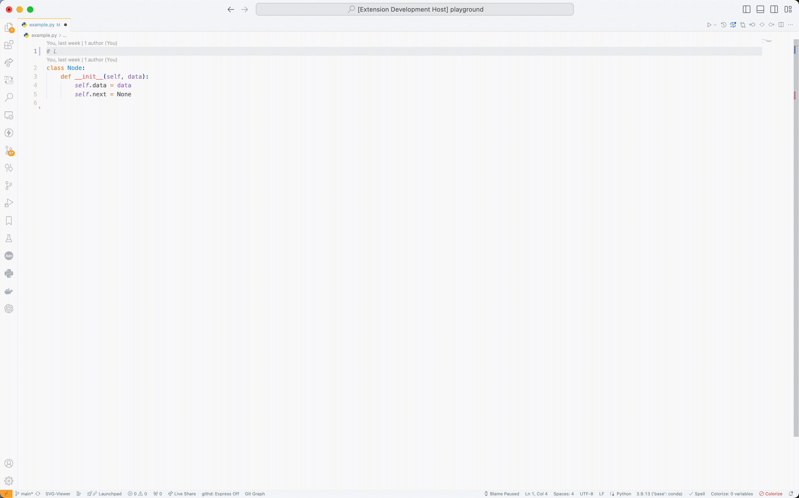

# Gemini Autocomplete README
A less intrusive AI Autocomplete Extension that works for my uses but feel free to use it as well.

## Setting up

Get an Gemini API key from https://aistudio.google.com/app/apikey and set it as `GEMINI_API_KEY` as an environment variable or set it as `gemini-autocomplete.geminiAPIKey` in your VSCode settings.

## Features

Ask Gemini for coding help using `@`. It will search everything that is on that line.

Additionally get multiline input to provide context using `> Gemini Assistant: Activate Gemini Assistant`

Support languages include javascript, typescript, python, cpp, rust, kotlin, c, go, java, php, ruby, swift, objective-c, perl, shellscript, scala, haskell, dart, r, matlab, lua, css, html

## Privacy and Data Collection

This extension does not collect any user data however information is being sent to Google Gemini's API. Only the lines that are selected are sent to Gemini.

## To Do
- [ ] Instead of CompletionItem maybe use grayed out text
- [x] Allow multiline questions to provide context
- [ ] Maybe set up GitHub CI (is this really needed?)
- [x] Auto Activate
- [ ] Update gif to not include activate
- [ ] Add Llama and ChatGPT eventually

## Release Notes

See full [change log](./CHANGELOG.md)

### 1.0.5 - 2024-07-19

Initial release of Gemini Autocomplete.
